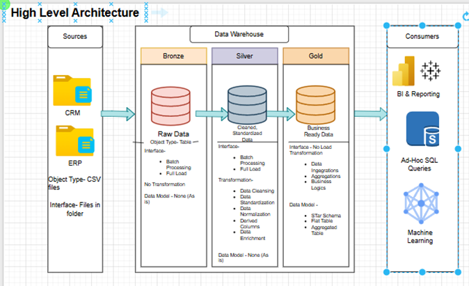

**Project Requirements
Building the Data Warehouse (Data Engineering)
Objective**

Develop a modern data warehouse using SQL Server to consolidate sales data, enabling analytical reporting and advanced decision making.

**Specifications**

•	**Data Sources:**
  Import data from two files ERP and CRM provided as CS files
  
**•**	Data Quality:** **
   Cleanse and resolve data quality issues prior to analysis
   
**•	**Integration: ****
   Combine both sources into a single, user-friendly data model designed for analytical queries
   
**•**	Scope:** **
   Focus on the latest dataset only, historization of data is not required
   
**•	**Documentation:**** 
   Provide clear documentation of the data model to support both business stakeholders and analytics

****BI: ****
    Analytics and Reporting (Data Analytics)

******Objective : ******
Data Architecture – designing and drawing

 **Project Requirements:**
 
**1.	Business Ownership**

•	Who owns the data
•	What Business Process it supports
•	System and Data documentation
•	Data Model and Data Catalog	

**2.	Architecture and Data Stack**

•	How is data stored
•	What are the integration capabilities

**3.	Extract and Load**

•	Increment Vs Full Load
•	Data Scope and Historical Loads
•	What is the expected size of the extracts?
•	Are there any data volume limitations?
•	How to avoid impacting the source system’s performance?
•	Authentication and Authorization

